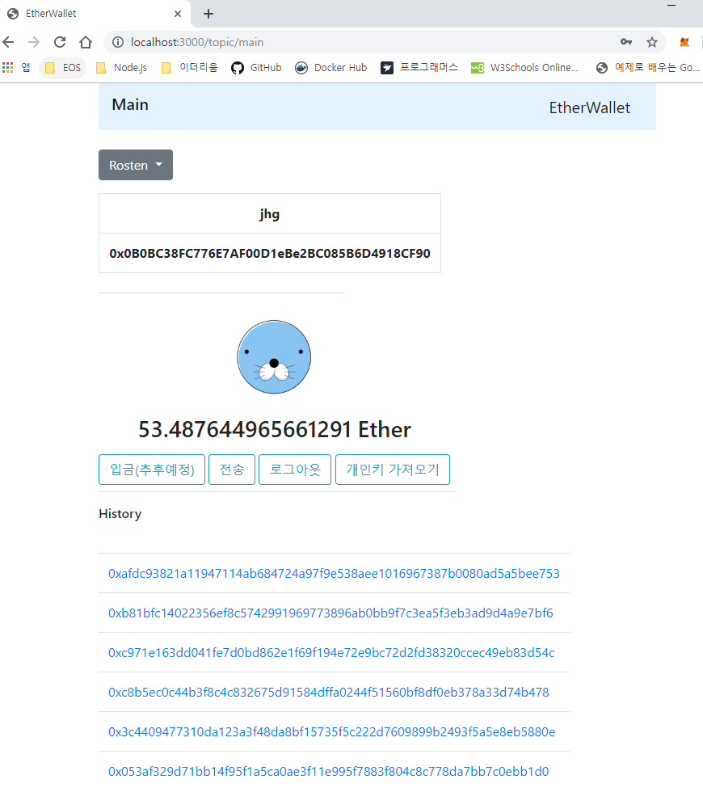
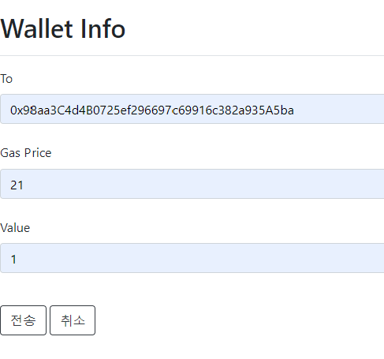

# ethwallet

회원가입 후 이더리움 계정을 발급받고 로그인하여 계정의 잔액, 이더리움 전송을 하는 웹 페이지

### 사용방법
1. ##### 소스 내려받고 서버 실행하는 법
```
$ git clone https://github.com/Hyun-Geol/ethwallet.git
$ cd ethwallet
$ npm i
$ npm start
```

2. ##### 시작 페이지(로그인)
    

3. ##### 회원가입 페이지
    (1) 계정생성
    

    (2) PrivateKey로 계정생성
    

4. ##### 메인 페이지
    

5. ##### 전송 페이지
    

6. ##### 프라이빗키 가져오기
    

7. ##### 에러 페이지

    (1) 로그인 실패시
    

    (2) 아이디 중복시
    

    (3) 로그인 에러시
    

